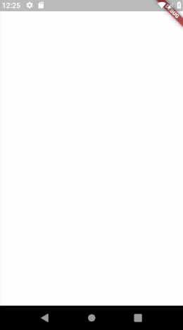
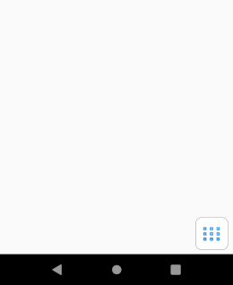
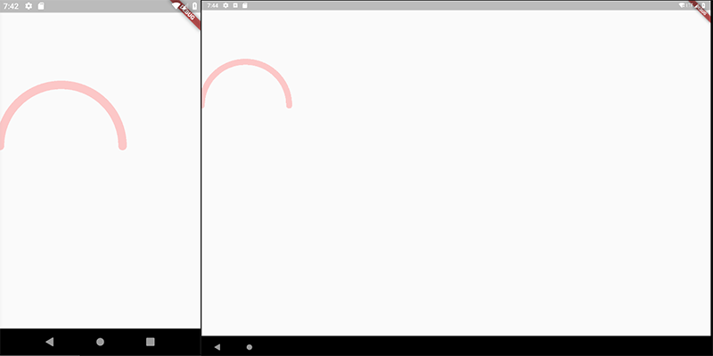
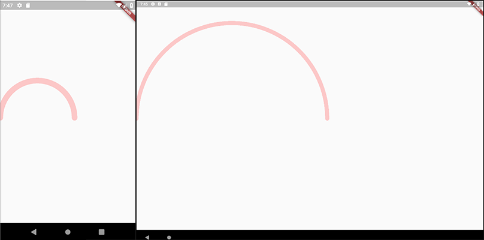

# animation_director

A package to create nice and smooth animations for flutter

## Introduction

A simple package to build beautiful and smooth animations for flutter framework. By using this package, you don't need 
to bother yourself with `AnimationController`s, `AnimationTweens` and also timing and of those animations.

Here there are some simple examples of what I've made with this package in 5 minutes for each one.






The following descriptions may sounds complicated but it's pretty simple, sorry for my bad english, I think if you jump to 
example directory and take a look at the codes, you'll find out it's really easy to use


## ActorWidget

Each object on the screen is called an `ActorWidget`.

`ActorWidget` has two required properties:

```dart
    @required String name;
    @required List<ActorAction> actions;
```

each `ActorAction` is an individual animation of the `ActorWidget`.

All `ActorWidget`s in your page run simultaneously.
All `ActorAction`s inside of an `ActorWidget` run sequentially, but you can control how much it waits before starts the animation
using `waitBeforeStart`


```dart
  // ___________________________________
  ActorWidget(                          |
    name: 'Actor1',                     |
    actions: [                          |
      // ___________                    |
      ActorAction(  |                   |
        ...         |                   |
      ),            |                   |
      ActorAction(  |                   |
        ...         | (Sequentially)    | (Simultaneously)
      ),            |                   |
      ActorAction(  |                   |
        ...         |                   |
      )             |                   |
      // ___________|                   |
  ]),                                   |
  ActorWidget(),                        | 
  ActorWidget(),                        |
  ActorWidget(),                        |
  // ___________________________________|
  
```


# ActorAction Features

Each `ActorAction` has following features

```dart
    List<String> group; // you can define one or multi group for action.
    Function onCompleted;
    Function onStart;
    Duration waitBeforeStart; // the amount of time the current action must wait to start, after the previous action is finished
    ActorPath path;
    ActorPosition position;
    ActorOpacity opacity;
    ActorCharacter character;
    ActorRotation rotation;
    ActorScale scale;
```

if you want to animate some of your `ActorWidget`s, you can give a name to the actions of your actor. then start your `AnimationDirector` by that group.
Using this, only `ActorWidget`s which has the given `group` animate.  
This is useful when you want to trigger an animation manually. see Example Menu3x3.


## ActorCharacter

The actor character! your actor is represented by `ActorCharacter`.

`ActorCharacter` has the following properties:

```dart
    Duration duration;
    Curve curve;
    double width;
    double height;
    Widget child;
    String clipPath; // the string of the clip path
    EdgeInsets padding;
    EdgeInsets margin;
    BoxDecoration decoration;
    BoxDecoration foregroundDecoration;
```

**Note**: `clipPath` type is string! if follows svg codes rule. and for now only supports `M`, `L`, `A`, `Q`.

In order to generate a path you can use [FlutterDev.site Path Creator](http://flutterdev.site/path-creator). 
Draw your path and copy `The Result` to the `clipPath` property


## ActorPosition

You can animate the position of `Actor` using `ActorPosition`.

`ActorPosition` has the following properties

```dart
    Duration duration;
    Curve curve;
    double top;
    double left;
    double right;
    double bottom;
```


## ActorOpacity

To change the opacity of your `Actor`.

`ActorOpacity` has the following properties

```dart
    Duration duration;
    Curve curve;
    double opacity;
```

## ActorScale

To change the scale of your `Actor`.

`ActorScale` has the following properties

```dart
    Duration duration;
    Curve curve;
    double startScale;
    double finishScale;
```

## ActorRotation

To rotate, flip horizontal or vertical your `Actor` widget, you can use `ActorRotation`.

`ActorRotation` has the following properties

```dart
    Duration duration;
    Curve curve;
    double rotationTurns;
    Alignment alignment;
    bool clockwise;
    double startTween;
    double verticalFlipTurns;
    double horizontalFlipTurns;
```
    

## ActorPath

You can draw a path by using `ActorPath`. and if you define an `ActorCharacter` along with `ActorPath`, the character will
move along the created path.

To draw your path again use [FlutterDev.site Path Creator](http://flutterdev.site/path-creator).

`ActorPath` has the following properties
    
```dart
    Duration duration;
    Curve curve;
    String path; // the String code of the path
    int traversePercentage; // the percentage of `ActorCharacter` movement along the path
    int startPositionInPercent; // the start position of animation in percent
    bool displayPath; // displays the path on the screen, 
    bool displayProgress; // displays the progress of path filling on the screen
    Offset offset; // you can align the position of ActorCharacter widget on the path
    Paint pathStyle; // style of the path line
    Paint progressStyle; // style of the progress line
    int progressLength; // the length of progress line, the default is as equal as the path
    int progressAnimationRepeat; // the repeat times of progress animation
    bool fadingProgress; // to make the tail of the progress line faded
```

# Path Creator

In order to create paths easily head to [FlutterDev.site Path Creator](http://flutterdev.site/path-creator).  
Draw your path and copy the generated code from `The Result`.

## Adaptive Size

By default, the generated path is based on fixed numbers of your path and has the following effect


 
If you want to draw your path to be adaptive to the screen of any device, you need to select `Adaptive Width`
or `Adaptive Height` or both if you want your path to be fully adaptive.
When you select for example `Adaptive Width`, the drawing-area width will be considered as mobile,tablet,... width so you get following
effect with `Adaptive Width`. (500 for example)



But keep in mind, in both cases, the result may be different on different screen-sizes. 


# Example

Let's say we want to animate an orange circle from top-center of the screen to the center. Then after 2 seconds,
move the circle to the bottom of the page.  


The first step is to create our character and position it to top of the page.
```dart
  ActorAction(
    position: ActorPosition(top: 0, left: 0, right: 0),
    character: ActorCharacter(
      child: Center(
        child: Container(
          width: 50,
          height: 50,
          decoration: BoxDecoration(
            color: Colors.orangeAccent,
            borderRadius: BorderRadius.circular(50),
          ),
        ),
      )
    ),
  ),
```

The second step is to move it to the center of the page, so let's add another `ActorAction`
```dart

    ...
    ActorAction(
        position: ActorPosition(
          curve: Curves.elasticOut,
          duration: Duration(milliseconds: 800),
          top: MediaQuery.of(context).size.height / 2 - 25),
    ),
    ...
    
```

And the final step is to move our circle to the bottom of the page after 2 seconds

```dart

    ...
    ActorAction(
        waitBeforeStart: Duration(seconds: 2),
        position: ActorPosition(
          duration: Duration(milliseconds: 800),
          curve: Curves.elasticOut,
          top: MediaQuery.of(context).size.height - 100),
    ),
    ...
    
```

and you get the following result


